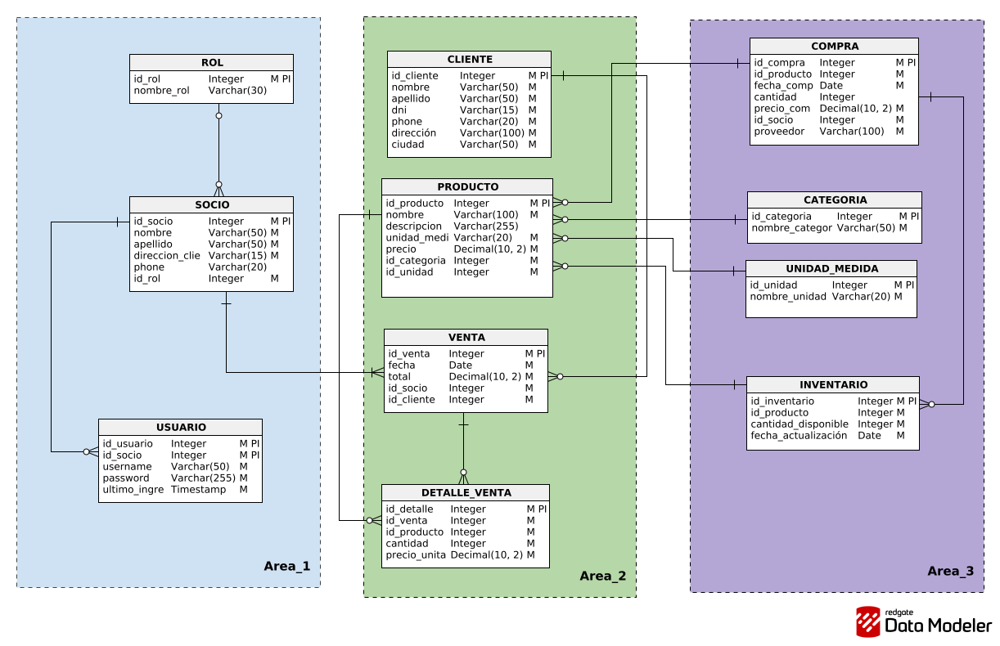
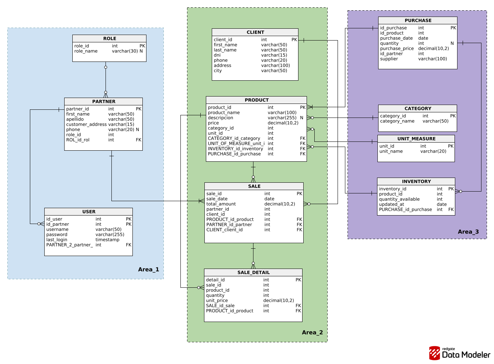

# Diseños de Base de Datos

## Diseño logico

[Ver PDF del diseño logico](../resources/ASOCIACION_DE_PITAJAYA_-_TUTAWAYTA_LOGICO.pdf)

## Diseño fisico

[Ver PDF del diseño fisico](../resources/ASOCIACION_DE_PITAJAYA_-_TUTAWAYTA_FISICO.pdf)

## Diccionario de datos

[Ver diccionario de base de datos](../documentation/Base_de_datos.md)
